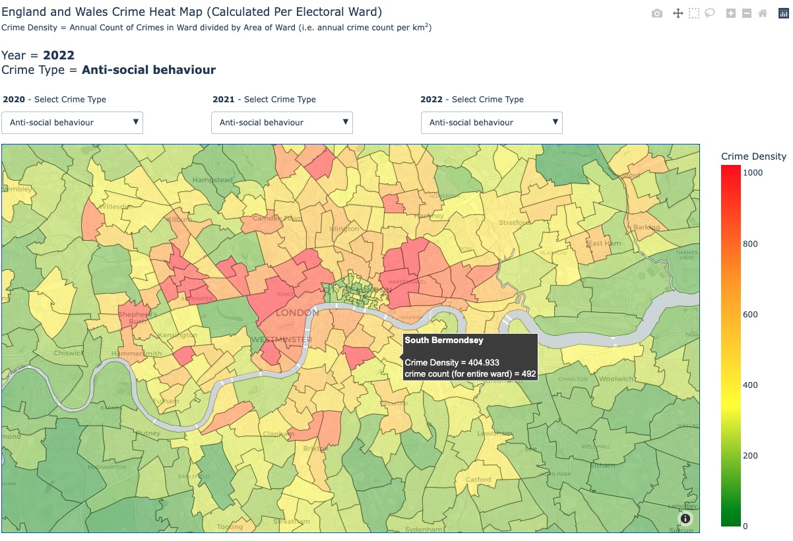

# England Crime Heatmaps 2022

## Objectives
The aim of this project was to use official UK police crime data to visualise crime rates across England. We wanted to test different plot types (such as choropleths and hex bins) to experiment with different ways of representing the data. We used 3 years of crime data, from between August 2019 and July 2022 (the most recently available data).

**Please Note** - *The UK police data did not include any data from Manchester (due to a data issue with the Manchester Police) and so our plots are missing data in this region.*

## Approach
The end to end approach, reasoning, data analysis and plotting is in the **crime_stats.ipynb** file. An outline of our approach is detailed below: 
1. Downloaded 3 years of crime data from [UK Police Website](https://data.police.uk/data/). This downloaded many separate csv files. 
2. Used a python script (stored in 'scripts' folder of repo) to combine all csvs into a single file. 
3. Downloaded electoral ward boundary data from the [Office for National Statistics](https://geoportal.statistics.gov.uk/search?q=wards) (this was used for the choropleth map). 
4. Used python and geopandas to clean and prepare the data.
5. Used plotly library to build interactive crime heatmaps. 

## Results
- We built 4 different interactive crime heatmaps (using the plotly library) which can be found under the 'plots' folder of this repo. 
- Plots that display multiple years of data or multiple crime types have drop downs to allow the user to select which years or crime types to view.
- All map files are html files that can be viewed by any web browser.
- Some maps have been compressed to make their file size compatible with github. 

The 4 maps are detailed below:
|File name|Plot Type|Geographic Area|Years Of Data|Crime Types|
|---|:---:|:---:|:---:|:---:|
|england_wales_crime_heatmap_choropleth|Choropleth Map|England and Wales|2020, 2021 and 2022|All|
|London_Crime_Heatmap_Scatter|Scatter Plot|London|2022|All|
|london_crime_heat_map_hex_bin|Hex Bin Map|London|2022|Violent and Sexual Crime|
|england_wales_ireland_crime_heat_map_hex_bin|Hex Bin Map|England, Wales and Northern Ireland|2022|Violent and Sexual Crime|

## Heatmaps Showcase
Below we will provide a preview and basic explanation of each crime heatmap. 
### England_wales_crime_heatmap_choropleth

