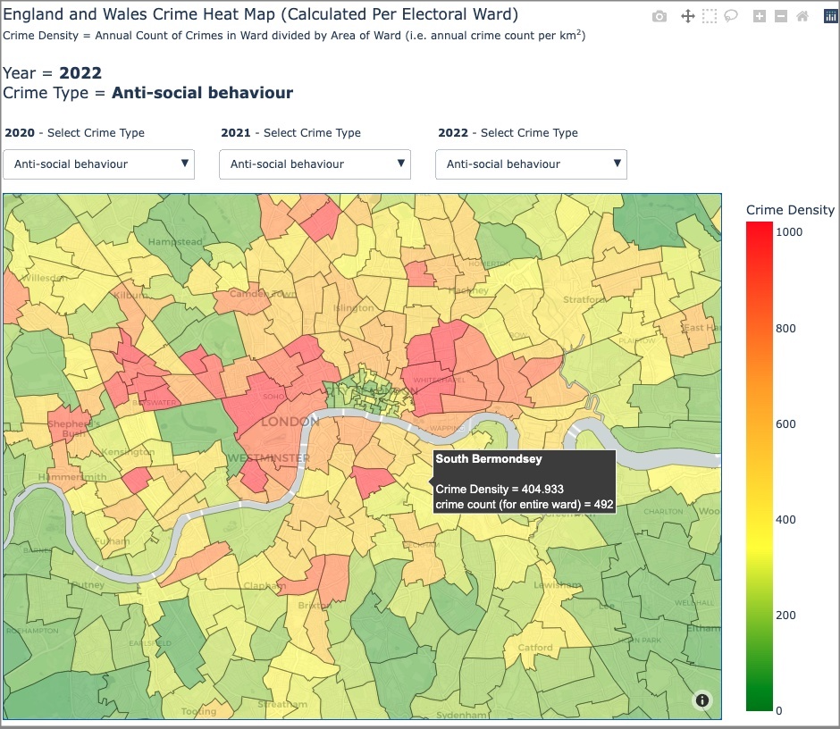
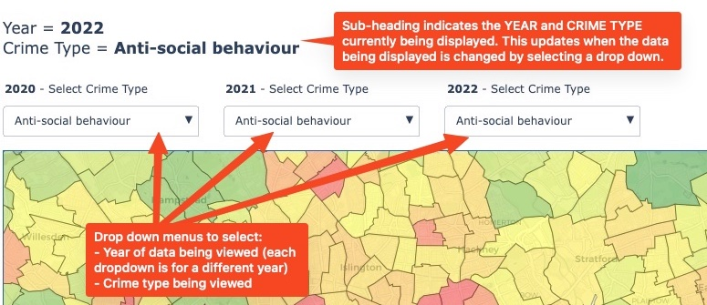
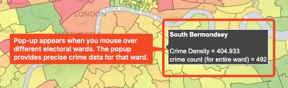
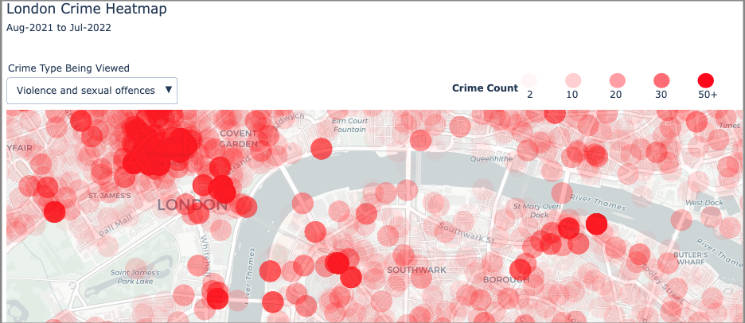

# England Crime Heatmaps 2022

## Objectives
The aim of this project was to use official UK police crime data to visualise the variation in crime rates across England and other UK territories. The key question we want to answer is **how likely it is for me to witness or experience a crime in different neighborhoods of the UK**. An example use case for our visualisations would be if someone were moving house and wanted to understand how safe different neighborhoods are. 

We wanted to test different geographic plot types (such as choropleths and hex bins) to experiment with different ways of representing the data. We used 3 years of crime data, between August 2019 and July 2022 (the most recently available data). . 

**Please Note** - *The UK police data did not include any data from Manchester (due to a data issue with the Manchester Police) and so our plots are missing data in this region.*

## Approach
The end to end approach, reasoning, data analysis and plotting is in the **crime_stats.ipynb** file. An outline of our approach is detailed below: 
1. Downloaded 3 years of crime data from [UK Police Website](https://data.police.uk/data/). This downloaded many separate csv files. 
2. Used a python script (stored in 'scripts' folder of repo) to combine all csvs into a single file. 
3. Downloaded electoral ward boundary data from the [Office for National Statistics](https://geoportal.statistics.gov.uk/search?q=wards) (this was used for the choropleth map). 
4. Used python and geopandas to clean and prepare the data.
5. Used plotly library to build interactive crime heatmaps. 

## Results
- We built 4 different interactive crime heatmaps (using the plotly library) which can be found under the 'plots' folder of this repo. 
- Plots that display multiple years of data or multiple crime types have drop downs to allow the user to select which years or crime types to view.
- All map files are html files that can be viewed by any web browser.
- Some maps have been compressed to make their file size compatible with github. 

The 4 maps are detailed below:
|File name|Plot Type|Geographic Area|Years Of Data|Crime Types|
|---|:---:|:---:|:---:|:---:|
|england_wales_crime_heatmap_choropleth|Choropleth Map|England and Wales|2020, 2021 and 2022|All|
|London_Crime_Heatmap_Scatter|Scatter Plot|London|2022|All|
|london_crime_heat_map_hex_bin|Hex Bin Map|London|2022|Violent and Sexual Crime|
|england_wales_ireland_crime_heat_map_hex_bin|Hex Bin Map|England, Wales and Northern Ireland|2022|Violent and Sexual Crime|

## Heatmaps Showcase
Below we will provide a preview and basic explanation of each crime heatmap: 

### England_wales_crime_heatmap_choropleth
This heatmap has split the UK into electoral wards. It aggregates the crime count in each electoral ward and represents the data via a colour scale. The electoral wards range from being very small areas to very large areas. This makes comparing the crime counts in different electoral wards misleading. Larger wards are likely to contain more crimes simply because they cover more area. They may actually have fewer crimes per km2 than a smaller ward, thus making it less likely that you would see or experience a crime within the larger ward. To account for this, we divided the crime count per electoral ward by the area of the electoral ward and called this the **crime density**. This is what is visualiused by the plot. 

This plot contains drop downs that allow you to select different years of data and different crime types to view: 

The plot also provides ward specific data by hovering the mouse over a ward: 

### London_Crime_Heatmap_Scatter
This map visualises crimes in London in the last year. Each reported crime is marked on the map as a small transparent red circle. When circles overlap (i.e. when crimes occur near one another) the red colors add together to become darker. Thus, darker areas of the plot indicate more crimes occuring in that area.

This plot contains a drop down that allows you to select different crime types to view: 

### london_crime_heat_map_hex_bin

### england_wales_ireland_crime_heat_map_hex_bin
